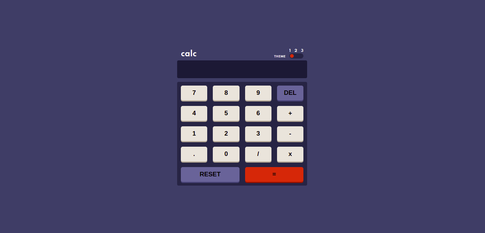
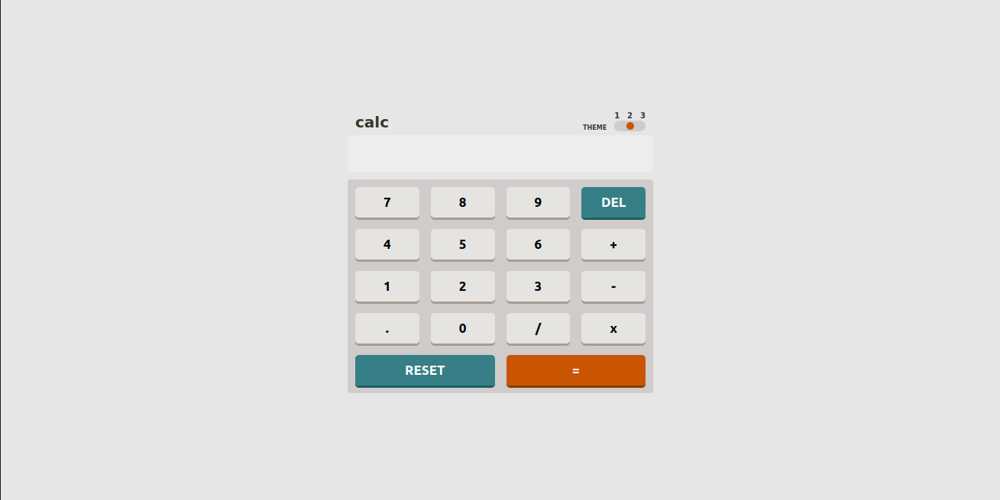
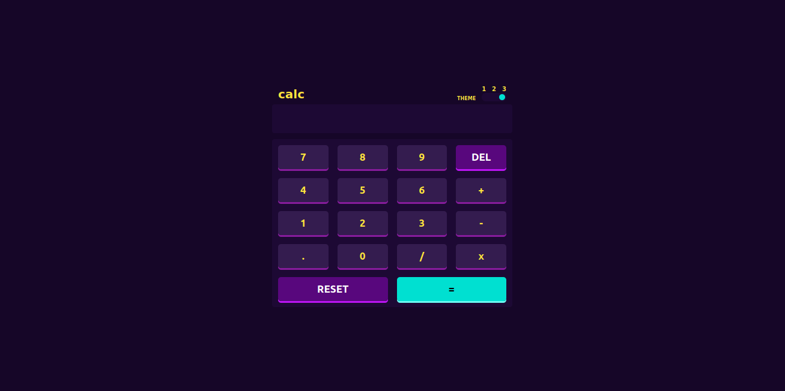

# Frontend Mentor - Calculator app solution

This is a solution to the [Calculator app challenge on Frontend Mentor](https://www.frontendmentor.io/challenges/calculator-app-9lteq5N29). Frontend Mentor challenges help you improve your coding skills by building realistic projects. 

## Table of contents

- [Overview](#overview)
 - [The challenge](#the-challenge)
 - [Screenshot](#screenshot)
 - [Links](#links)
- [My process](#my-process)
 - [Built with](#built-with)
 - [What I learned](#what-i-learned)
- [Author](#author)

 ## Overview

### The challenge

Users should be able to:

- Use the site on every screen size.
- Perform mathematical operations like multiplication, addition, subtraction and division.
- Adjust the color theme based on their preference.
- Still get their prefered theme or chosen theme after refreshing the page

### Screenshot

# First Theme


# Second Theme


# Third Theme


### Links

- Solution URL: [Add solution URL here](https://your-solution-url.com)
- Live Site URL: [Add live site URL here](https://your-live-site-url.com)

## My process

### Built with

- Semantic HTML5 markup
- CSS custom properties
- Flexbox
- CSS Grid
- Responive design
- LocalStorage
- [React](https://reactjs.org/) - JS library

### What I learned

```js
const [colorTheme, setColorTheme] = useState('firstTheme');
useEffect(() => {
  const currentThemeColor = localStorage.getItem('theme-number');
  if (currentThemeColor) {
    setColorTheme(currentThemeColor);
  }
}, []);
const toggleTheme = (theme) => {
    setColorTheme(theme);
    localStorage.setItem('theme-number', theme);
};

## Author

- Twitter - [@_dewaley](https://www.twitter.com/_dewaley)